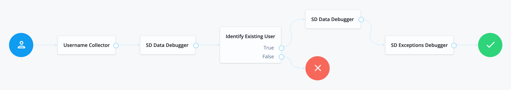

# Scripted Decision Debugger

## Overview

The [scripted-decision-debugger.js](scripted-decision-debugger.js) code could be used in a scripted decision node script to display debug information in a pop-up window and/or in the login screen during an authentication journey.

The pop-up window can continuously display the log data from the parent login window, and serve as a log tailing tool. You will need to allow pop-ups for your AM origin.

The log data presentation and appearance are easy to change with some basic JavaScript and CSS.

> In addition, by default, the logs will be outputted with the `logger.error(String log)` method. This can be disabled with the `noLoggerError: true` option.

Optionally, you can enable control of this this functionality with a URL query string parameter `&debug=true|false`. This can be enabled by providing the `useDebugParameter` option

## How it works

The [scripted-decision-debugger.js](scripted-decision-debugger.js) code contains a function and an example of a caller. See comments in the function code for the supported options.

## How to make it work

* Copy the code from [scripted-decision-debugger.js](scripted-decision-debugger.js) and paste it at the bottom of your scripted decision node debugger script.
* In your scripted decision node script, create an array of log messages or choose a single message to be displayed in the browser.
* Using the provided example, call the `showLogs(Object options)` function and pass in your message(s) as an option.
* In your authentication journey/tree, add a scripted decision at a place where you want to output some content, and select the debugger script as the Script. Add "true" outcome to proceed with.

## Examples

The two example scripted decision node (SD) scripts below were used in the following journey in the SD Data Debugger and the SD Exceptions Debugger nodes:



In both scripts, logs are displayed in the pop-up window _and_ in the login screen, but using only one of the display options is also supported:


Both of the scripts had the code copied and pasted from [scripted-decision-debugger.js](scripted-decision-debugger.js).

### Script 1: the SD Data Debugger script

In the first script, the log messages are populated with some generic data that could be collected and displayed at different points in an authentication journey.

```javascript
// CUSTOM CODE

/**
 * An array of log messages, populated with the journey data.
 */
var logs = []

logs.push('Data Debugger')
logs.push('sharedState: ' + sharedState)
logs.push('<div style="color: red;">ATTENTION!</div>')
logs.push('transientState: ' + transientState)

/**
 * Calls the function copied from scripted-decision-debugger.js.
 */
showLogs({
    logs: logs,
    // popupTitle: 'Debugger',
    // useDebugParameter: true,
    // noLoggerError: true,
    // noPopup: true,
    // noText: true
})

// END OF CUSTOM CODE

// CONTENT FROM scripted-decision-debugger.js:
. . .
```

### Script 2: the SD Exceptions Debugger script

In the second script, the log messages are populated with some exceptions that might occur in an authentication journey.

```javascript
// CUSTOM CODE

/**
 * An array of log messages, populated with the journey data.
 */
var logs = []

logs.push('Exceptions Debugger')

try {
    sharedStateKeys = sharedState.keySet()
} catch (e) {
    logs.push(e)
}

try {
    password = secrets.getGenericSecret("scripted.node.secret.id").getAsUtf8()
} catch(e) {
    logs.push(e)
}

/**
 * Calls the function copied from scripted-decision-debugger.js.
 */
showLogs({
    logs: logs,
    // popupTitle: 'Debugger',
    // useDebugParameter: true,
    // noLoggerError: true,
    // noPopup: true,
    // noText: true
})

// END OF CUSTOM CODE

// CONTENT FROM scripted-decision-debugger.js:
. . .
```
