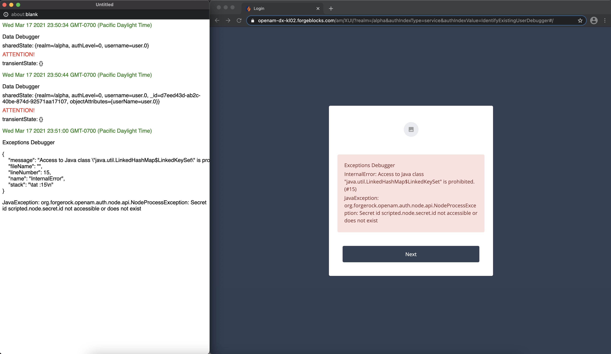

# Scripted Decision Debugger

The [scripted-decision-debugger.js](scripted-decision-debugger.js) code could be added to a scripted decision node script.

It contains a function which accepts an array of log messages to be displayed in a pop-up window and/or in the login screen during an authentication journey.

In addition, the log messages will be optionally outputted with the `logger.error(String message)` method.

The pop-up window can continuously display the log data from the parent window, and serve as a log tailing tool. The log data presentation and appearance are easy to change with basic JavaScript and CSS.

You will need to allow pop-ups for your AM origin.

Optionally, you can control presence of the log data in the user interface with a URL query string parameter `&debug=true`. This can be enabled by providing the `useDebugParameter` option in the function call.

See comments in the function code for additional details.

## Authentication Journey Example


## Logs Output Example



## AM Script Examples

Two example scripts are provided, which were used in the above journey, both including the function copied from [scripted-decision-debugger.js](scripted-decision-debugger.js).

In both examples, logs are displayed in the pop-up window _and_ in the login screen, but using only one of the display options is also supported.

### Script 1: Data Debugger

In the first script, which was associated with the SD Data Debugger nodes shown above, the log messages are populated with generic data, that could be collected and displayed at different points in an authentication journey.

```javascript
// CUSTOM CODE

/**
 * Namespace for the script variables.
 */
var frScript = {}

/**
 * An array of messages, populated with the journey data.
 */
frScript.messages = []
frScript.messages.push('Data Debugger')
frScript.messages.push('sharedState: ' + sharedState)
frScript.messages.push('<div style="color: red;">ATTENTION!</div>')
frScript.messages.push('transientState: ' + transientState)

/**
 * Outputs the log messages on the server side.
 *
 * The same array of log messages could be printed out using the logger object methods.
 */
frScript.messages.forEach(function (message) {
    logger.error(String(message))
})

/**
 * Calls the function copied from scripted-decision-debugger.js.
 */
showLogs({
    logs: frScript.messages,
    // popupTitle: 'Debugger',
    // useDebugParameter: true,
    // noLoggerError: true,
    // noPopup: true,
    // noText: true
})

// END OF CUSTOM CODE

// CONTENT FROM scripted-decision-debugger.js:
. . .
```

### Script 2: Exceptions Debugger

In the second script, which was associated with the SD Exception Debugger node, the log messages are populated with exceptions that might occur in an authentication journey.

```javascript
// CUSTOM CODE

/**
 * Namespace for the script variables.
 */
var frScript = {}

/**
 * An array of messages, populated with the journey data.
 */
frScript.messages = []
frScript.messages.push('Exceptions Debugger')

try {
    frScript.sharedStateKeys = sharedState.keySet()
} catch (e) {
    frScript.messages.push(e)
}

try {
    password = secrets.getGenericSecret("scripted.node.secret.id").getAsUtf8()
} catch(e) {
    frScript.messages.push(e)
}

/**
 * Outputs the log messages on the server side.
 *
 * The same array of log messages could be printed out using the logger object methods.
 */
frScript.messages.forEach(function (message) {
    logger.error(String(message))
})

/**
 * Calls the function copied from scripted-decision-debugger.js.
 */
showLogs({
    logs: frScript.messages,
    // popupTitle: 'Debugger',
    // useDebugParameter: true,
    // noLoggerError: true,
    // noPopup: true,
    // noText: true
})

// END OF CUSTOM CODE

// CONTENT FROM scripted-decision-debugger.js:
. . .
```
